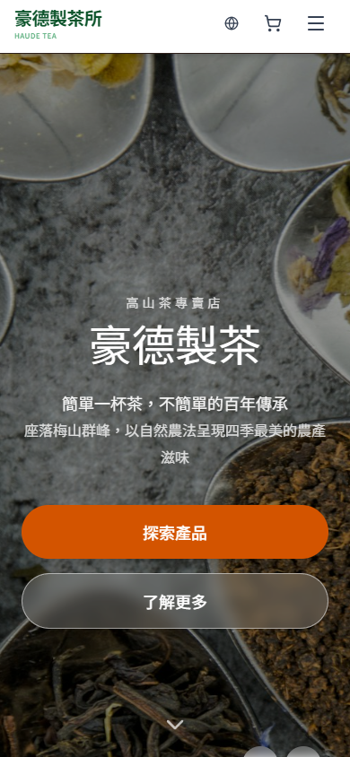
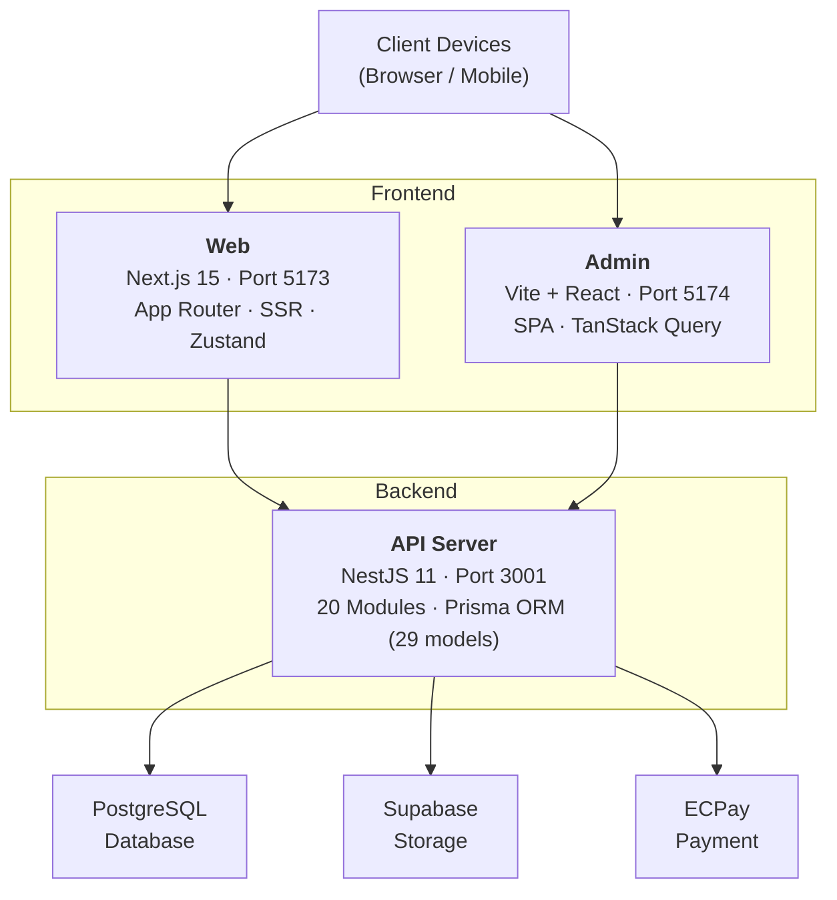
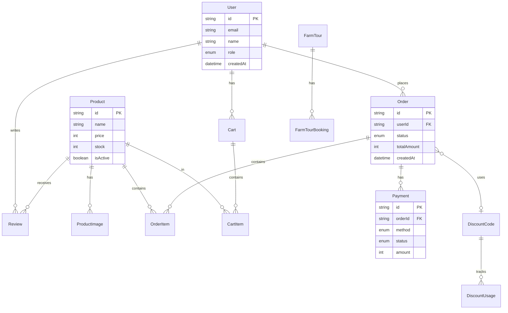
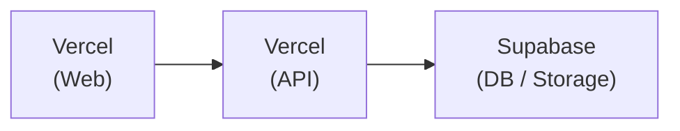

<div align="center">

# 豪德製茶所 Haude Tea

**Monorepo Full-Stack E-Commerce Platform**

A production-grade tea e-commerce platform built with Next.js 15, NestJS 11, and PostgreSQL. Features ECPay payment integration, JWT refresh token rotation, scroll-driven animations, and a complete admin dashboard.

[](https://haude-web.vercel.app/)

[](https://nextjs.org/)
[](https://nestjs.com/)
[](https://www.typescriptlang.org/)
[](https://www.prisma.io/)
[](https://tailwindcss.com/)
[](https://pnpm.io/)

</div>

---

## Screenshots

| Desktop | Mobile |
|:---:|:---:|
|  |  |

| Products | Cart |
|:---:|:---:|
|  |  |

---

## Project Stats

<table>
<tr>
<td align="center"><strong>628</strong><br/>TypeScript Files</td>
<td align="center"><strong>20</strong><br/>API Modules</td>
<td align="center"><strong>29</strong><br/>Prisma Models</td>
<td align="center"><strong>17</strong><br/>Admin Pages</td>
</tr>
</table>

---

## Architecture Highlights

### Security: JWT Refresh Token Rotation with Replay Attack Detection

The auth system implements a **token family** approach: each refresh token is single-use and linked to a family ID. When a revoked token is reused (potential replay attack), the system automatically revokes **all tokens** for that user, forcing re-authentication. This mitigates token theft scenarios where an attacker and legitimate user race to refresh.

### Payments: ECPay Facade Pattern

The payment module uses a **Facade pattern** with 6 specialized services behind a unified interface:
- `EcpayOrderService` &mdash; trade creation & CheckMacValue signing
- `EcpayNotifyService` &mdash; async payment notification handling
- `EcpayRefundService` &mdash; full & partial refund logic across all channels
- `EcpayQueryService` &mdash; payment status polling
- `EcpayReturnService` &mdash; browser redirect handling
- `EcpayConfigService` &mdash; environment-aware credential management

### Frontend: Scroll-Driven Narrative Animations

The homepage tea ceremony section uses a **300vh scroll container** to drive keyframe animations tied to scroll progress. Built with a custom `useScrollProgress` hook that is SSR-safe (guards against `window` access) and uses `requestAnimationFrame` for smooth 60fps updates.

### Cart: Guest / Logged-in Dual-Track Architecture

- **Guest users**: cart stored in `localStorage` with 14-day TTL
- **Logged-in users**: cart synced to database via API
- **Auto-merge on login**: guest cart items are merged into the server cart, with conflict resolution (higher quantity wins)

### Storage: Supabase Signed Upload

Product images are uploaded **directly from the browser to Supabase Storage** using signed URLs. The API server generates a short-lived upload URL, keeping file transfer off the Node.js event loop and reducing server bandwidth costs.

### Build: Turborepo Smart Caching

The monorepo uses Turborepo's dependency graph to determine build order (`types` &rarr; `api` / `web` / `admin`). Each task defines precise `inputs` and `outputs` for cache invalidation, skipping rebuilds when upstream files haven't changed.

---

## Features

### Customer-Facing (Next.js)

- Full shopping flow: browse &rarr; cart &rarr; checkout &rarr; payment
- Multiple payment methods via ECPay (credit card, ATM, convenience store)
- Member system with registration, login, password reset
- Order tracking with real-time status updates
- Discount code validation and application
- Farm tour browsing and booking
- i18n support (Traditional Chinese / English)
- Responsive design (320px+)

### Admin Dashboard (Vite + React)

- Revenue analytics and order overview
- Product CRUD with image upload (Supabase Storage)
- Order status management and shipment processing
- Payment records and refund processing
- Discount code management with usage statistics
- User management with role-based access control

---

## System Architecture



---

## Tech Stack

<table>
<tr>
<th>Layer</th>
<th>Technology</th>
<th>Version</th>
</tr>
<tr>
<td rowspan="5"><strong>Frontend</strong></td>
<td>Next.js (App Router)</td>
<td>15</td>
</tr>
<tr>
<td>React</td>
<td>19</td>
</tr>
<tr>
<td>TypeScript</td>
<td>5.9</td>
</tr>
<tr>
<td>Tailwind CSS</td>
<td>4</td>
</tr>
<tr>
<td>Zustand</td>
<td>5</td>
</tr>
<tr>
<td rowspan="3"><strong>Backend</strong></td>
<td>NestJS</td>
<td>11</td>
</tr>
<tr>
<td>Prisma</td>
<td>7</td>
</tr>
<tr>
<td>PostgreSQL</td>
<td>15</td>
</tr>
<tr>
<td rowspan="3"><strong>Infra</strong></td>
<td>pnpm + Turborepo</td>
<td>Monorepo</td>
</tr>
<tr>
<td>Docker</td>
<td>Compose</td>
</tr>
<tr>
<td>Vercel + Supabase</td>
<td>Deployment</td>
</tr>
</table>

---

## Data Model



---

## Monorepo Structure

```
haude-monorepo/
├── apps/
│   ├── web/                 # @haude/web - Customer frontend (Next.js 15)
│   │   ├── src/
│   │   │   ├── app/         # App Router pages
│   │   │   ├── components/  # React components (90+)
│   │   │   ├── stores/      # Zustand state
│   │   │   ├── services/    # API service layer
│   │   │   └── hooks/       # Custom hooks
│   │   └── package.json
│   │
│   ├── admin/               # @haude/admin - Admin dashboard (Vite)
│   │   ├── src/
│   │   │   ├── pages/       # Admin pages (17)
│   │   │   ├── components/  # Admin components
│   │   │   └── services/    # API services
│   │   └── package.json
│   │
│   └── api/                 # @haude/api - Backend API (NestJS 11)
│       ├── src/
│       │   ├── modules/     # Feature modules (20)
│       │   └── prisma/      # Prisma service
│       ├── prisma/
│       │   └── schema.prisma
│       └── package.json
│
├── packages/
│   └── types/               # @haude/types - Shared TypeScript types
│
├── docker-compose.yml
├── turbo.json
├── pnpm-workspace.yaml
└── package.json
```

---

<details>
<summary><strong>Getting Started</strong></summary>

### Prerequisites

- Node.js 20+
- pnpm 9+
- PostgreSQL 15+ (or Supabase)

### Installation

```bash
# 1. Clone
git clone https://github.com/aim840912/haude-monorepo.git
cd haude-monorepo

# 2. Install dependencies
pnpm install

# 3. Configure environment variables
cp apps/api/.env.example apps/api/.env
cp apps/web/.env.example apps/web/.env.local
cp apps/admin/.env.example apps/admin/.env.development

# 4. Initialize database
cd apps/api
npx prisma generate
npx prisma migrate dev
cd ../..

# 5. Start all services
pnpm dev
```

### Service URLs

| Service | URL | Description |
|---------|-----|-------------|
| Web | http://localhost:5173 | Next.js storefront |
| Admin | http://localhost:5174 | Vite admin dashboard |
| API | http://localhost:3001/api/v1 | NestJS REST API |
| API Docs | http://localhost:3001/docs | Swagger UI |

</details>

<details>
<summary><strong>API Documentation</strong></summary>

> All endpoints prefixed with `/api/v1` (except health check)

### Auth

| Method | Endpoint | Description |
|--------|----------|-------------|
| POST | `/api/v1/auth/register` | User registration |
| POST | `/api/v1/auth/login` | User login |
| GET | `/api/v1/auth/me` | Get current user |
| POST | `/api/v1/auth/forgot-password` | Forgot password |
| POST | `/api/v1/auth/reset-password` | Reset password |

### Products

| Method | Endpoint | Description |
|--------|----------|-------------|
| GET | `/api/v1/products` | List products |
| GET | `/api/v1/products/:id` | Product details |
| POST | `/api/v1/admin/products` | Create product (admin) |
| PUT | `/api/v1/admin/products/:id` | Update product (admin) |
| DELETE | `/api/v1/admin/products/:id` | Delete product (admin) |

### Orders

| Method | Endpoint | Description |
|--------|----------|-------------|
| GET | `/api/v1/orders` | User orders |
| GET | `/api/v1/orders/:id` | Order details |
| POST | `/api/v1/orders` | Create order |
| PATCH | `/api/v1/orders/:id/cancel` | Cancel order |

### Payments (ECPay)

| Method | Endpoint | Description |
|--------|----------|-------------|
| POST | `/api/v1/payments/ecpay/create` | Initiate payment |
| POST | `/api/v1/payments/ecpay/notify` | Payment callback |
| GET | `/api/v1/payments/ecpay/return` | Payment return page |

### Cart

| Method | Endpoint | Description |
|--------|----------|-------------|
| GET | `/api/v1/cart` | Get cart |
| POST | `/api/v1/cart/items` | Add item |
| PUT | `/api/v1/cart/items/:productId` | Update quantity |
| DELETE | `/api/v1/cart/items/:productId` | Remove item |

### More Endpoints

| Method | Endpoint | Description |
|--------|----------|-------------|
| POST | `/api/v1/discounts/validate` | Validate discount code |
| GET | `/api/v1/products/:id/reviews` | Product reviews |
| POST | `/api/v1/products/:id/reviews` | Submit review |
| GET | `/api/v1/farm-tours` | List farm tours |
| POST | `/api/v1/farm-tours/:id/book` | Book farm tour |
| GET | `/health` | Health check (no prefix) |

</details>

<details>
<summary><strong>Environment Variables</strong></summary>

Copy the example files and fill in your values:

```bash
cp apps/api/.env.example apps/api/.env
cp apps/web/.env.example apps/web/.env.local
cp apps/admin/.env.example apps/admin/.env.development
```

### Key Variables

| App | Variable | Description |
|-----|----------|-------------|
| API | `DATABASE_URL` | PostgreSQL connection string |
| API | `JWT_SECRET` | Secret key for JWT signing |
| API | `ECPAY_MERCHANT_ID` | ECPay merchant ID |
| API | `ECPAY_HASH_KEY` | ECPay hash key |
| API | `ECPAY_HASH_IV` | ECPay hash IV |
| API | `SUPABASE_URL` | Supabase project URL |
| API | `SUPABASE_SERVICE_ROLE_KEY` | Supabase service role key |
| Web | `NEXT_PUBLIC_API_BASE_URL` | API server base URL |
| Admin | `VITE_API_BASE_URL` | API server base URL |

> See each app's `.env.example` for the complete list of required variables.

</details>

<details>
<summary><strong>Deployment</strong></summary>

### Vercel + Supabase (Recommended)



### Docker

```bash
docker-compose up -d     # Build & start
docker-compose logs -f   # View logs
docker-compose down      # Stop services
```

</details>

---

## Author

**Tien-Chih Cheng**

- GitHub: [@aim840912](https://github.com/aim840912)

---

## License

This project is licensed under the **Creative Commons Attribution-NonCommercial 4.0 International (CC BY-NC 4.0)** license.

You may view, share, and adapt this project for non-commercial purposes with attribution. Commercial use is not permitted.

See the [LICENSE](./LICENSE) file for details.

<div align="center">

**[Back to Top](#豪德製茶所-haude-tea)**

</div>
